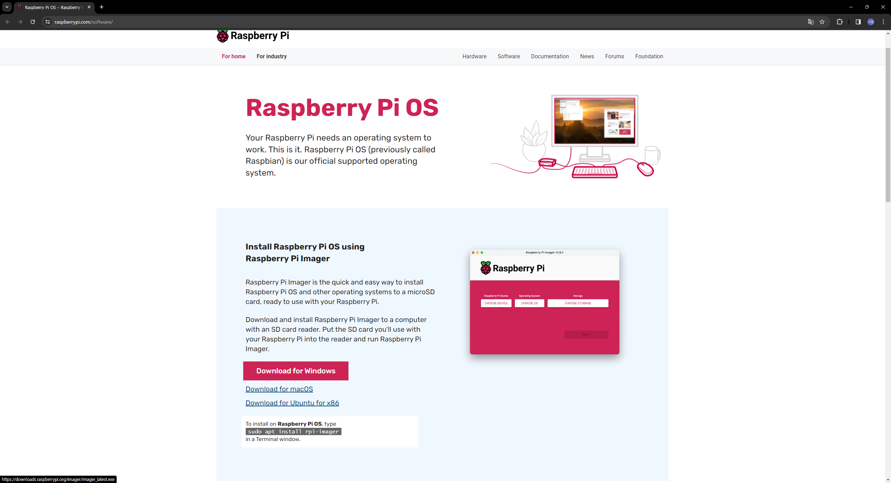
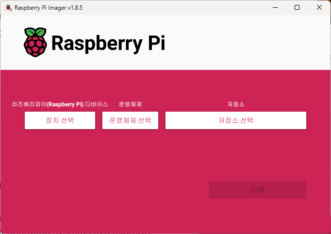
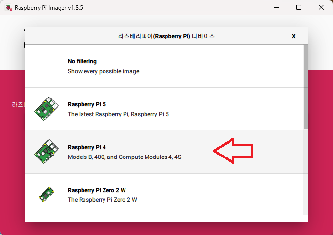

로봇 셋업
==========

**목표:** 로봇에 맞는 OS를 설치한다.

이 과정에서는 로봇에 OS를 설치하는 방법에 대해서 설명합니다.
다른 버전을 설치하여도 상관 없으나 `zeta2_edu_devel <https://github.com/zetabank-devteam/zeta2_edu_devel.git>`__ 과 `zeta2_edu_autonomous <https://github.com/zetabank-devteam/zeta2_edu_autonomous>`__ 을 사용하기 위해선 ubuntu 22.04 를 설치할 것을 권장합니다.

전제조건
--------

1. WiFi가 되는 PC(일반적인 PC는 WiFi를 지원하지 않을 수도 있습니다. 그럴 땐 세팅 작업은 LAN 선으로도 할 수 있습니다. 또한 WiFi 동글을 하나 구해서 WiFi가 되게 하는 것도 하나의 방법입니다.)

2. zeta2 로봇

3. SD 카드를 읽을 수 있는 도구(일반적인 PC에는 SD 카드를 바로 연결할 수 없습니다. 읽을 수 있는 노트북이나 PC라면 없어도 됩니다.)

.. image:: images/sdcard_reader.png


1 로봇에 우분투 22.04 OS 설치
^^^^^^^^^^^^^^^^^^^^^^^^^^^^^^^^^^^

이 과정은 먼저 PC에서 하는 과정과 로봇에서 하는 과정 2가지로 나뉘어 집니다.

1.1 PC에서
~~~~~~~~~~~

`라즈베리파이 imager <https://www.raspberrypi.com/software/>`__ 를 자신의 PC 환경에 맞게 다운로드 합니다.



첫 화면에선 3개의 선택지가 있을 것입니다.



가장 먼저 장치선택을 클릭하고 다음 나온 화면에서 Raspberry Pi 4 선택합니다.




다시 첫 화면으로 돌아간 다음 운영체제를 선택하고 Other general-purpose OS -> Ubuntu -> 22.04 (64-bit) 순서로 찾아서 선택합니다.

.. image:: images/raspberrypi_imager_3.png

.. image:: images/raspberrypi_imager_4.png

.. image:: images/raspberrypi_imager_5.png

다시 첫 화면으로 돌아와 이번에는 저장소 선택에서 현재 사용하기 위해 연결한 SD 카드를 선택합니다.

.. image:: images/raspberrypi_imager_6.png

다음 -> 예 -> 완료

.. image:: images/raspberrypi_imager_7.png

.. image:: images/raspberrypi_imager_8.png

.. image:: images/raspberrypi_imager_9.png


1.2 로봇에서
~~~~~~~~~~~

OS가 설치된 SD카드를 로봇의 위를 들어 올려서 라즈베리 파이에 장착합니다.

초기 작업에선 로봇을 인터넷에 연결해야 하므로 인터넷선을 연결합니다.(라즈베리 파이는 WiFi도 사용할 수 있지만 우리는 라즈베리 파이의 WiFi를 HotSpot으로 사용할 것이기 때문에 LAN 선을 연결합니다.)

로봇에 키보드와 마우스도 연결해 줍니다. 처음 실행은 `이 가이드 <https://linuxgenie.net/how-to-download-and-install-ubuntu-22-04/>`__ 를 참고합니다. 지역설정은 Seoul, 이름과 비밀번호는 본인이 원하는 것으로 합니다.


이제 로봇에서 우분투를 사용할 준비가 끝났습니다.


2 로봇 ``HotSpot`` 설정하기
^^^^^^^^^^^^^^^^^^^^^^^^^^^^^^^^^^^

이번 과정에선 로봇이 인터넷이 되지 않는 환경에서도 PC와 연결할 수 있게 로봇을 ``HotSpot`` 으로 구성할 것입니다.

``HotSpot`` 의 이름은 이더넷 맥 어드레스 뒤의 4개로 하기로 하겠습니다.


먼저 아래의 사진이 나오는 것입니다.

.. image:: images/wifi_1.png

ip 주소를 얻는 방법은 여러개가 있으나 가장 쉬운 방법은 ``ifconfig`` 라는 명령어를 사용하는 것 입니다. 그러기 위해선 우분투의 ``net-tools`` 패키지가 설치되어야 합니다.

.. code-block:: bash

   sudo apt update
   sudo apt install net-tools

``net-tools``가 설치 되었으면 이제 아래의 명령어로 정보를 확인할 수 있습니다. 아래의 정보는 ``HotSpot`` 을 설정한 이 후의 출력결과 입니다. 

방금 전의 이미지에 나오는 정보처럼 나오게 될 것 입니다.

.. code-block:: bash

   zeta@zeta-desktop:~$ ifconfig
   eth0: flags=4163<UP,BROADCAST,RUNNING,MULTICAST>  mtu 1500
         inet 192.168.0.119  netmask 255.255.255.0  broadcast 192.168.0.255
         inet6 fe80::17d4:711e:d14c:390b  prefixlen 64  scopeid 0x20<link>
         ether e4:5f:01:f2:'e7:98'  txqueuelen 1000  (Ethernet)
         RX packets 23653  bytes 28893076 (28.8 MB)
         RX errors 0  dropped 0  overruns 0  frame 0
         TX packets 16292  bytes 13972500 (13.9 MB)
         TX errors 0  dropped 0 overruns 0  carrier 0  collisions 0

   lo: flags=73<UP,LOOPBACK,RUNNING>  mtu 65536
         inet 127.0.0.1  netmask 255.0.0.0
         inet6 ::1  prefixlen 128  scopeid 0x10<host>
         loop  txqueuelen 1000  (Local Loopback)
         RX packets 595  bytes 54723 (54.7 KB)
         RX errors 0  dropped 0  overruns 0  frame 0
         TX packets 595  bytes 54723 (54.7 KB)
         TX errors 0  dropped 0 overruns 0  carrier 0  collisions 0

   wlan0: flags=4163<UP,BROADCAST,RUNNING,MULTICAST>  mtu 1500
         inet 10.42.0.1  netmask 255.255.255.0  broadcast 10.42.0.255
         inet6 fe80::eb54:a26d:6e0e:514e  prefixlen 64  scopeid 0x20<link>
         ether e4:5f:01:f2:e7:99  txqueuelen 1000  (Ethernet)
         RX packets 0  bytes 0 (0.0 B)
         RX errors 0  dropped 0  overruns 0  frame 0
         TX packets 50  bytes 5259 (5.2 KB)
         TX errors 0  dropped 0 overruns 0  carrier 0  collisions 0

여기서 ``eht0`` 의 안에 있는 ``ether`` 의 정보를 확인해 봅시다. 

.. code-block:: bash

   eth0: flags=4163<UP,BROADCAST,RUNNING,MULTICAST>  mtu 1500
   ...
         ether e4:5f:01:f2:'e7:98'  txqueuelen 1000  (Ethernet)
   ...

``e7:98`` 을 확인할 수 있습니다. 이 ``e798`` 이 우리 HotSpot의 뒷 이름이 될 것 입니다.


sudo apt install openssh-server
```

다음으론 핫스팟을 키는 법에 대해 설명하겠습니다.

먼저 바탕화면에서 우측 상단 클릭

.. image:: images/wifi_2.png

나온 선택지에서 ``WiFi-Not Connected``

.. image:: images/wifi_3.png

다음은 ``Wi-Fi Settings``


다음으론 ``점 세개``


다음으로 ``Turn On Wi-Fi Hotspot...``

.. image:: images/wifi_6.png

이름을 설정할 때 아까 위에서 확인했던 ``e798`` 를 입력합니다

.. code-block:: bash
      
   Network Name: zeta2_e798

   Password: 12345678

``Turn On`` 버튼을 눌러주면 일단 HotSpot은 생성 됩니다.


하지만 우리는 로봇을 껐다가 켰을 때도 HotSpot 상태를 유지하고 싶습니다.

아래의 순서를 따라하면 됩니다.

.. code-block:: bash
   sudo -H gedit /etc/NetworkManager/system-connections/Hotspot.nmconnection

   autoconnect=false -> autoconnect=true


2 로봇 ``openssh-server`` 설정하기
^^^^^^^^^^^^^^^^^^^^^^^^^^^^^^^^^^^

후에 PC와의 연결을 위해 ``openssh-server`` 를 설치합니다.

.. code-block:: bash
   
   sudo apt update
   sudo apt install openssh-server

요약
-------

로봇을 사용하기 위해서 SD 카드에 우분투 OS를 설치하고 로봇의 ``HotSpot`` 을 설정하는 작업을 완료했습니다.

또한 나중에 PC와의 연결을 위해 ``openssh-server`` 을 설치했습니다.

다음 단계
----------

다음으론 좀 더 편리한 사용을 위해서 PC에서 로봇에 접속하고 로봇을 사용하는 방법을 학습하겠습니다.