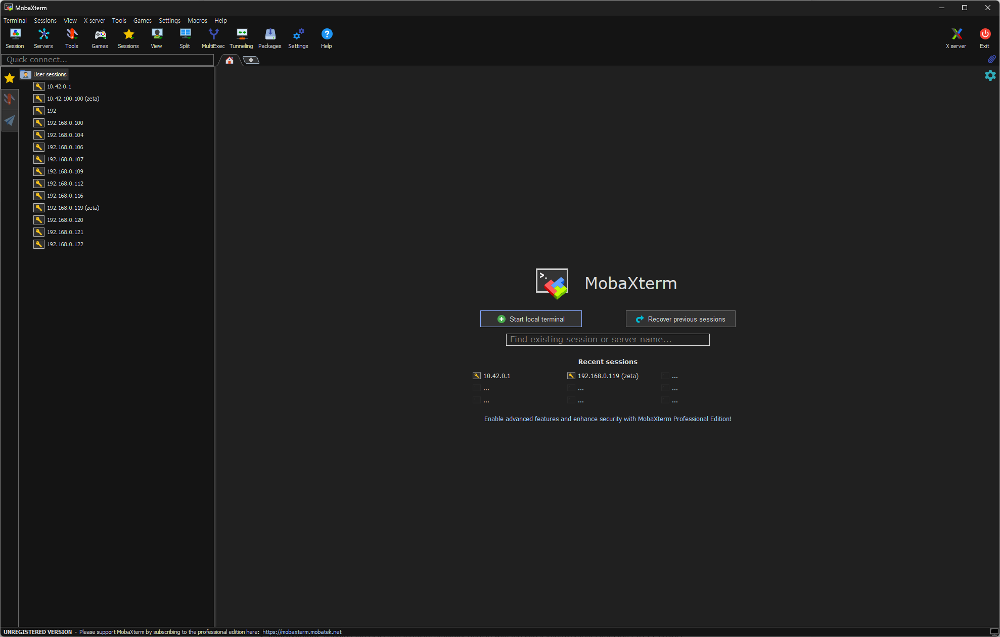
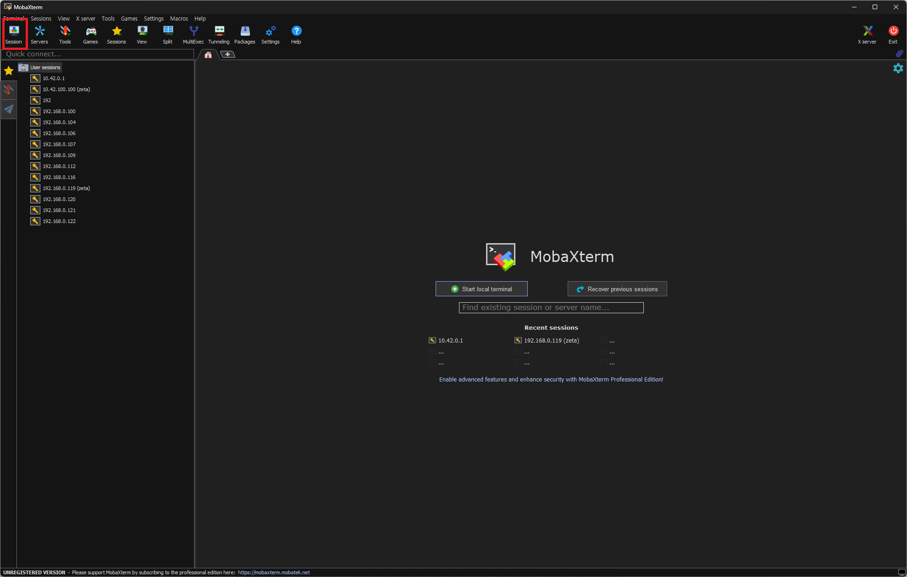
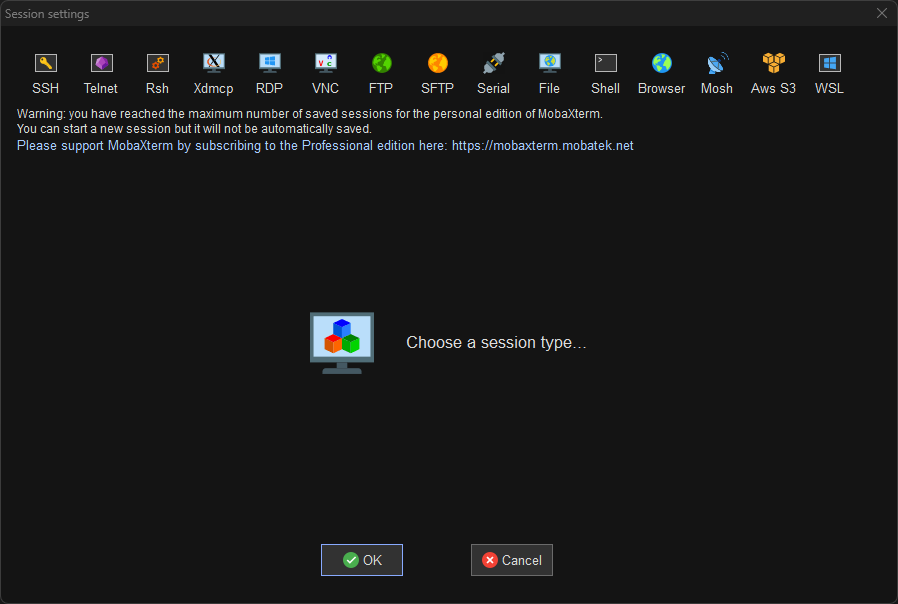
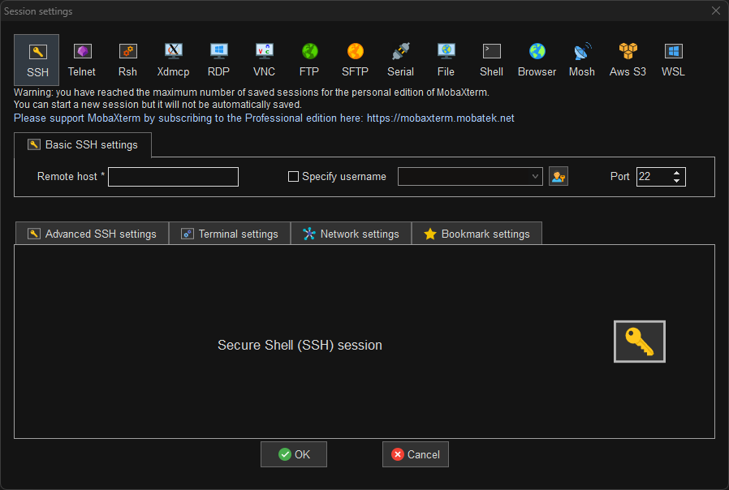
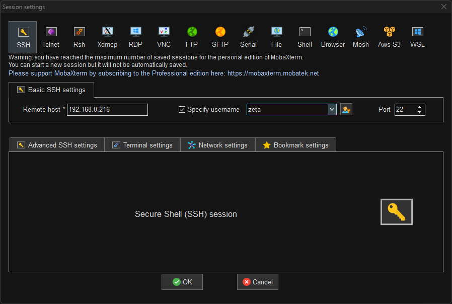
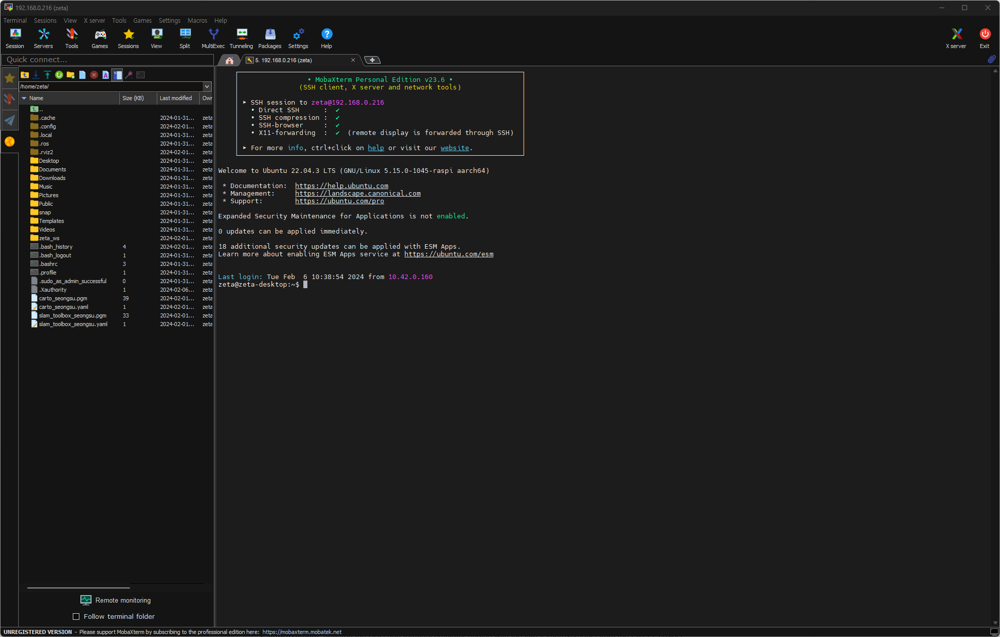

PC 셋업
==========

**목표:** PC에서 로봇과 쉽게 연결할 수 있게 한다.

이 과정에서는 PC에서 로봇에 연결하는 방법을 알려줍니다.

다른 프로그램도 많지만 여기선 `mobaXterm <https://mobaxterm.mobatek.net/>`__ 을 사용합니다. 
그 이유는 DISPLAY 설정을 따로 하지 않아도 쉽게 로봇의 화면을 볼 수 있기 때문입니다.

전제조건
--------

1. WiFi가 되는 PC(일반적인 PC는 WiFi를 지원하지 않을 수도 있습니다. 그럴 땐 세팅 작업은 LAN 선으로도 할 수 있습니다. 또한 WiFi 동글을 하나 구해서 WiFi가 되게 하는 것도 하나의 방법입니다.)

2. :doc:`전 작업 <./1.robot_setup>` 이 끝난 zeta2 로봇

1 PC에 **mobaXterm** 설치
^^^^^^^^^^^^^^^^^^^^^^^^^^^^^^^^^^^

https://mobaxterm.mobatek.net/download-home-edition.html

위의 링크로 들어가서 **mobaXterm** 을 다운로드 받습니다. ``Portable edition`` 과 ``Installer edition`` 두 가지가 있습니다.

``Portable edition`` 은 이동식 버전입니다. PC에 설치해서 사용하는 것이 아닌 그냥 사용할 수 있는 버전입니다.

``Installer edition`` 은 설치 버전입니다. PC에 설치해서 사용하는 버전입니다.

둘 중 더 선호하는 버전으로 사용하면 됩니다.

전 ``Installer edition`` 을 사용해보겠습니다.

버튼을 눌러 설치하면 보통은 PC의 다운로드 폴더로 저장될 것 입니다. 확인을 해 보면 ``MobaXterm_Installer_v**.*.zip`` 의 형태로 되어 있을 겁니다. 여기서 ** 은 버전의 숫자입니다.

원하는 폴더로 ``MobaXterm_Installer_v**.*.zip`` 파일을 옮긴 후 압축을 풀어줍니다.

압축을 풀고 나온 ``MobaXterm_Installer_v**.*.msi`` 파일을 실행한 후

원하는 경로에 설치 한 후 실행 해주면 됩니다.

실행하면 아래와 같은 새로운 프로그램이 실행될 것입니다.

사진의 경우엔 왼쪽 ``User sessions`` 를 보면 다양한 숫자들이 있을텐데 이것은 다른 로봇들의 ``IP`` 입니다. 이 ``IP`` 를 사용하여 로봇에 ``ssh`` 연결을 한 뒤 로봇의 우분투에 명령을 할 것입니다.

2 PC로 로봇에 연결
^^^^^^^^^^^^^^^^^^^^^^^^^

전의 과정을 잘 따라 했으면 이제 PC에서 로봇에 연결하는 과정이 남았습니다.

로봇에 연결 할 수 있는 IP는 크게 2개가 있을 것 입니다.

1. 로봇 ``HotSpot`` 의 IP 주소

2. 로봇 ``ehternet`` 의 IP 주소

처음 작업할 때는 안정성을 위해 로봇 ``ethernet`` 의 IP 주소로 연결하는 것을 추천합니다. 

**주의사항: ehternet의 IP로 연결할 경우엔 PC와 로봇이 같은 네트워크 상에 있어야 합니다.**

처음 로봇에 LAN 선을 연결하고 ifconfig 명령어로 확인했을 때 우리는 로봇의 ethernet IP 또한 확인할 수 있었습니다.

.. code-block:: bash

   zeta@zeta-desktop:~$ ifconfig
   eth0: flags=4163<UP,BROADCAST,RUNNING,MULTICAST>  mtu 1500
         inet 192.168.0.216  netmask 255.255.255.0  broadcast 192.168.0.255
         inet6 fe80::f71a:f424:9abf:3eb3  prefixlen 64  scopeid 0x20<link>
         ether e4:5f:01:f8:f6:61  txqueuelen 1000  (Ethernet)
         RX packets 1016  bytes 317553 (317.5 KB)
         RX errors 0  dropped 0  overruns 0  frame 0
         TX packets 400  bytes 79180 (79.1 KB)
         TX errors 0  dropped 0 overruns 0  carrier 0  collisions 0

   lo: flags=73<UP,LOOPBACK,RUNNING>  mtu 65536
         inet 127.0.0.1  netmask 255.0.0.0
         inet6 ::1  prefixlen 128  scopeid 0x10<host>
         loop  txqueuelen 1000  (Local Loopback)
         RX packets 352  bytes 38404 (38.4 KB)
         RX errors 0  dropped 0  overruns 0  frame 0
         TX packets 352  bytes 38404 (38.4 KB)
         TX errors 0  dropped 0 overruns 0  carrier 0  collisions 0

   wlan0: flags=4163<UP,BROADCAST,RUNNING,MULTICAST>  mtu 1500
         inet 10.42.0.1  netmask 255.255.255.0  broadcast 10.42.0.255
         inet6 fe80::a097:ebc1:3651:680  prefixlen 64  scopeid 0x20<link>
         ether e4:5f:01:f8:f6:62  txqueuelen 1000  (Ethernet)
         RX packets 431  bytes 65224 (65.2 KB)
         RX errors 0  dropped 0  overruns 0  frame 0
         TX packets 145  bytes 26839 (26.8 KB)
         TX errors 0  dropped 0 overruns 0  carrier 0  collisions 0

네 바로 저 부분 입니다.

그럼 이제 ``mobaXterm`` 에서 로봇에 연결하는 법을 배워보겠습니다.

먼저 ``mobaXterm`` 화면에서 ``Session`` 버튼을 클릭합니다.

다음과 같은 화면이 나오는걸 확인할 수 있습니다.

여기서 SSH버튼을 클릭합니다.

그러면 이제 입력할 수 있는 곳들이 생깁니다. 여기서 우린 확인했던 ``IP`` 를 입력할 수 있고 처음 우분투 설치할 때 사용했던 ``우분투 계정의 이름`` 을 입력할 수 있습니다.
``우분투 계정의 이름`` 은 지금 입력하지 않아도 됩니다. 대신 그럴 경우엔 매번 새롭게 접속 할 때 마다 ``우분투 계정의 이름`` 을 입력해야 합니다.

저 같은 경우엔 ``IP`` 주소가 ``192.168.0.216``, ``우분투 계정의 이름`` 은 ``zeta`` 이므로 입력해주겠습니다. 아래와 같이 Specify username을 체크하면 입력할 수 있습니다.

입력을 다 하고 ``OK`` 버튼을 클릭해주면

연결이 되는걸 확인할 수 있습니다.

요약
-------

PC에서 로봇에 연결하는 방법을 학습했습니다. 이제 우리는 PC에서 로봇의 터미널에 명령을 줄 수 있습니다. 

뒤의 배우는 모든 과정의 기본은 먼저 PC에서 로봇에 연결하는 것입니다. 로봇의 위가 계속 열린채로 교육을 할 수는 없기 때문이죠~~~

마지막의 자율주행 할 때를 제외하면 되도록이면 LAN 선을 사용하는 것을 추천합니다.

다음 단계
----------

다음엔 로봇에서 ROS2 설치 하는 방법에 대해서 알아보겠습니다.