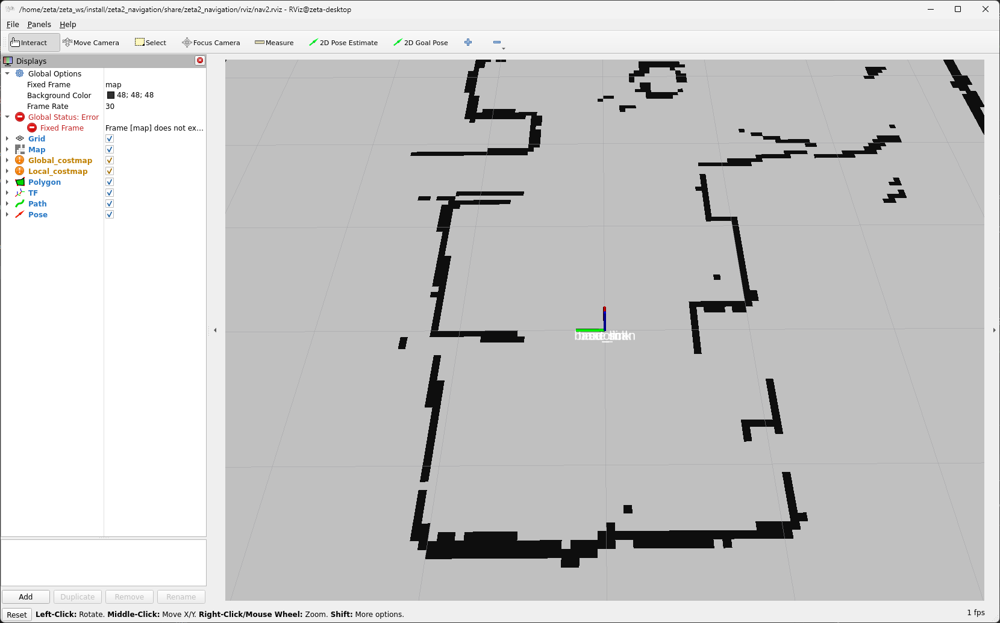

zeta2 autonomous
=================

**목표:** 로봇이 자율주행 할 수 있게 한다.

이 과정에서는 로봇을 사용하여 ``mapping`` 하고 ``navigation`` 하는 것 까지 해보겠습니다.

``mapping`` 의 방법으론 ``slam_tool_box`` 패키지와 ``cartographer`` 패키지 두개를 사용해서 해보도록 하겠습니다.

전제조건
--------

:doc:`zeta2_bringup <./1.zeta2_bringup>` 을 먼저 완료해야 합니다.

1 필요한 패키지들 설치
^^^^^^^^^^^^^^^^^^^^^^^^^^^^^^^

``slam_tool_box`` 패키지와 ``cartographer``, ``navigation`` 관련 패키지는 아래의 명령어로 설치할 수 있습니다.

.. code-block:: bash

   # slam_toolbox
   sudo apt install ros-humble-slam-toolbox -y

   # cartographer
   sudo apt install ros-humble-cartographer -y
   sudo apt install ros-humble-cartographer-ros -y

   # navigation
   sudo apt install ros-humble-navigation2 -y
   sudo apt install ros-humble-nav2-bringup -y

다음으론 zeta2_autonomous 패키지를 설치하겠습니다.

.. code-block:: bash
   
   source /opt/ros/humble/setup.bash

   cd ~/zeta_ws/src
   git clone https://github.com/zetabank-devteam/zeta2_edu_autonomous.git

   cd ~/zeta_ws
   colcon build --packages-select zeta2_navigation zeta2_slam_toolbox zeta2_cartographer

   source ~/zeta_ws/install/setup.bash

이제 필요한 패키지들은 설치가 완료 되었습니다. 이제 사용법에 대해서 설명하겠습니다.

2 slam tool box 매핑
^^^^^^^^^^^^^^^^^^^^^^^

먼저 ``zeta2_bringup`` 을 실행합니다.

.. code-block:: bash

   ros2 launch zeta2_bringup zeta2_bringup.launch.py # if, mc, control, odom, making tf, scan

새로운 터미널을 열고 조이스틱 조작을 위해 zeta_joy를 실행한다.

.. image:: images/2_slam.png

.. code-block:: bash

   ros2 launch zeta2_bringup zeta_joy.launch.py

새로운 터미널을 열고 zeta_slam_toolbox를 실행한다.

.. code-block:: bash
   
   ros2 launch zeta2_slam_toolbox zeta2_slam_toolbox.launch.py

.. image:: images/3_toolbox.png

.. image:: images/4_toolbox.png

조이스틱으로 조작하며 맵을 확장해나간다.

rviz 화면을 보고 지도를 다 그리면 지도를 저장한다. 'Map saved successfully'가 나오면 성공

.. code-block:: bash

   ## ros2 run nav2_map_server map_saver_cli -f {원하는 지도 이름}
   ## 예시
   ros2 run nav2_map_server map_saver_cli -f slam_toolbox_seongsu

.. image:: images/6_toolbox.png

3 cartographer 매핑
^^^^^^^^^^^^^^^^^^^^^^^

먼저 ``zeta2_bringup`` 을 실행한다.

.. code-block:: bash

   ros2 launch zeta2_bringup zeta2_bringup.launch.py # if, mc, control, odom, making tf, scan

새로운 터미널에서 조이스틱 조작을 위해 ``zeta_joy`` 를 실행한다.

.. image:: images/2_slam.png

.. code-block:: bash

   ros2 launch zeta2_bringup zeta_joy.launch.py

새로운 터미널에서 zeta_cartographer를 실행한다.

.. code-block:: bash

   ros2 launch zeta2_cartographer zeta2_cartographer.launch.py

조이스틱으로 조작하며 맵을 확장해나간다.

.. image:: images/5_carto.png

rviz 화면을 보고 지도를 다 그리면 지도를 저장한다. 'Map saved successfully'가 나오면 성공

.. code-block:: bash

   ## ros2 run nav2_map_server map_saver_cli -f {원하는 지도 이름}
   ## 예시
   ros2 run nav2_map_server map_saver_cli -f carto_seongsu

.. image:: images/6_carto.png

4 navigation2 실행
^^^^^^^^^^^^^^^^^^

만들었던 맵을 zeta2_navigation/maps 폴더에 잘 넣는다. (맵은 ``pgm`` 파일과 ``yaml`` 파일 두개 다 필요하다.)

맵을 다 넣었다면 zeta2_navigation 패키지만 빌드를 해준다.

.. code-block:: bash
   
   cd ~/zeta_ws
   colcon build --packages-select zeta2_navigation

zeta2_navigation 패키지의 zeta2_navigation 런치 파일을 실행한다.

.. code-block:: bash

   source ~/zeta_ws/install/setup.bash

   ros2 launch zeta2_navigation zeta2_navigation.launch.py

로봇의 초기 위치를 세팅한다. 2D Pose Estimate를 클릭하고 초기 위치와 방향에 맞춰 드래그 한다.

2D Goas Pose를 클릭하고 원하는 위치 방향에 맞춰 드래그 하면 로봇이 움직인다.

요약
-------

``slam toolbox`` 와  ``cartographer`` 를 사용하여 매핑 하는 법을 배웠습니다.

``navigation2`` 를 사용하여 자율주행 하는 법을 배웠습니다.

구체적이고 자세한 설명은 각각의 패키지들에 대한 설명사이트를 참고하시길 바랍니다.(`slam_toolbox <https://github.com/SteveMacenski/slam_toolbox>`__, `cartographer <https://google-cartographer.readthedocs.io/en/latest/>`__, `navigation2 <https://navigation.ros.org/>`__)
